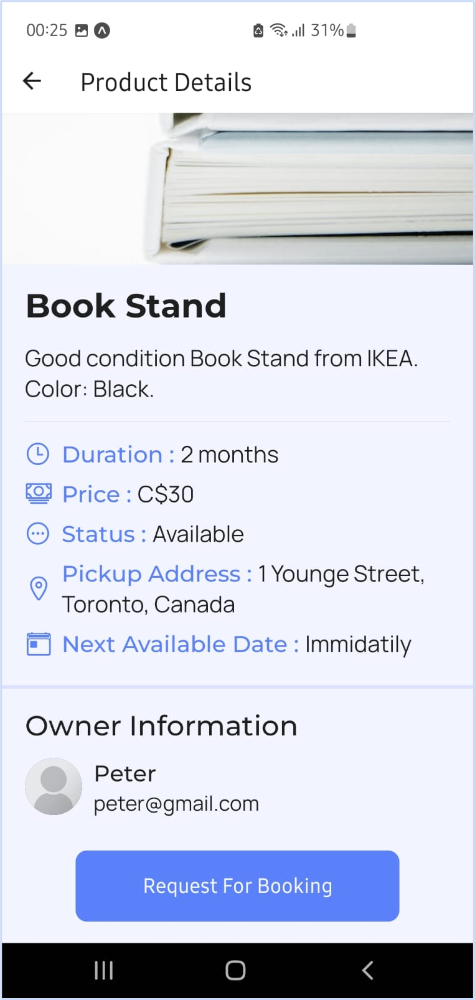
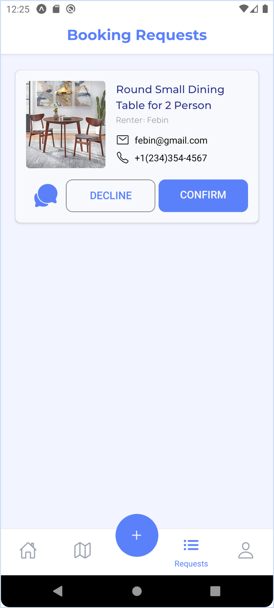
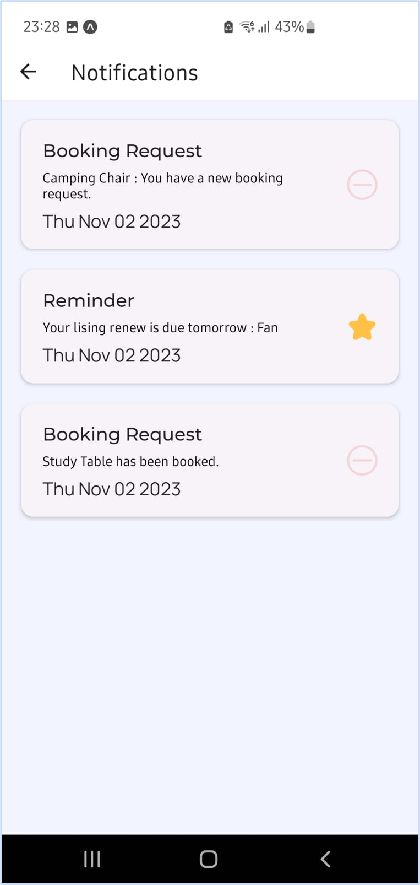

# RecurRent

🚀 RecurRent Mobile App 📱

## 📝 Description

RecurRent is a mobile application that allows users to rent out underutilized items and equipment for extra cash. The app can be used to rent out any type of goods, including furniture, biking equipment, hardware equipment, luggage bags, camping equipment, sports equipment, and more.

## 📱 Usage

The Recurrent app is easy to use. Simply list the items you want to rent out, set your rental price, and wait for renters to contact you. You can also browse items that other users have listed for rent and contact them to arrange a rental.

## 🌟 Features

- List items for rent
- Set rental price
- Browse items listed by other users
- Contact other users to arrange rental

## 📷 Screenshots

                    
<!-- 
 -->

<!-- ## 📚 Installation

coming soon
1. Clone the repository
2. Install dependencies using `npm install`
3. Run the app using `npm start` -->

## 🤝 Contributors

- Sahildeep Singh Randhawa  `Dev / DevOps`
- Chitra Raval  `Dev / DB Admin`
- Shagun Thukral  `Product Analyst`
- Diya Patel  `Designer`

## 📝 License

Private project.
